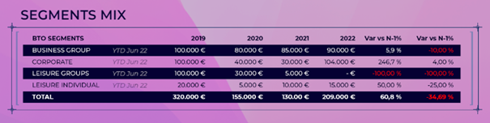

### C’est quoi, votre zone primaire ?

Elle est aussi appelée « zone de chalandise » et correspond à la zone d’attractivité la plus élevée. C’est dans cette zone que vous toucherez la majorité de votre clientèle. Entre autres, c’est le business que les entreprises, les organisations locales et les particuliers proches de votre hôtel vous apportent, de manière directe et indirecte. La zone primaire concerne tous les segments B2B : Corporate, Mice, Loisir, Sport et Spectacles.

### Pourquoi la développer ?

La développer, c’est travailler son influence commerciale et sa visibilité. C’est comprendre les besoins de service dans votre zone de chalandise, pour passer d’un hôtel « normal » à un hôtel performant.

### Et comment faire ?

Très simplement, en 3 actions :

#### Action 1 : à l’aide des outils d’analyse, identifier votre mix client

Tout d’abord, nous vous recommandons de réaliser une étude sur les différents segments de clientèle (mix clients) au moins 1 fois par an. Vous pouvez extraire ces données depuis vos outils.

Pour les hôtels ACCOR :

👉 Vous pouvez trouver ces informations en vous rendant sur les outils : Anais, Cvent, PMS : Fols, Opera, TARS reporting et/ou en vous rapprochant de votre Revenue Manager. Les données sont à extraire directement depuis votre RMS ou PMS en sélectionnant les RMLs correspondant aux segments (ex : Business Groups = RMLs)

Pour tous les autres hôtels :

👉 Rapprochez-vous de votre Revenue Manager

Voici ce que vous devriez obtenir :

Maintenant, établissez le Top & Flop 10 clients par segment.

Pour les hôtels ACCOR :

👉 Les données sont à extraire depuis Anais ou dans votre PMS en utilisant la Tars Key correspondant à chacun des clients. Etudiez les RFP (request for proposal) de l’année précédente sur Cvent.

Pour les autres hôtels :

👉 Continuez d’interroger votre Revenue Manager

Voici ce que vous devriez obtenir :

Maintenant, établissez le Top & Flop 10 clients par segment.